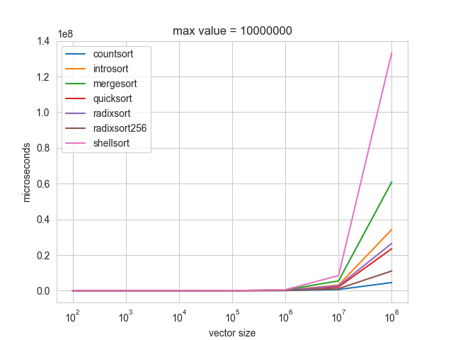
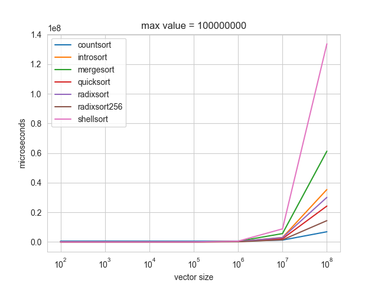
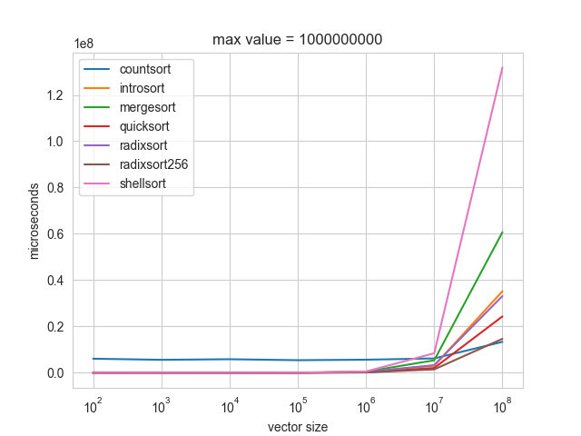
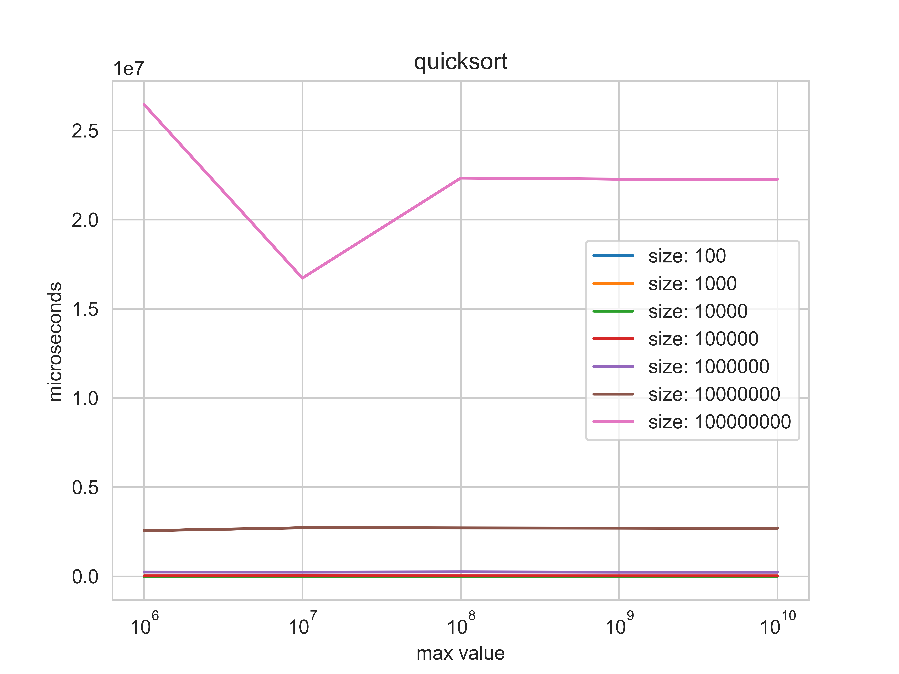

# Data structures project 1

---

Implemented 5 sorting algorithms: **Radixsort**(base 10 and base 256), **Shellsort**, **Mergesort**, **Quicksort** and **Countsort**.

Compared them with C++ sorting algorithm (**Introsort**).

Made in python graphics which shows their complexity and how the maximum value and the vector size affects time efficiency.

---

A series of 5 photos will follow to show how the maximum value plays a role in time efficiency in sorting algorithms.

Until 10^8 maximum value, **Countsort** displays a good efficiency. Afterwards, **Radixsort** in base 256 is the most efficient.

---

## Countsort 
(O(N+K), N - number of elements, K - range of the elements)

Good sorting algorithm if the range of the elements is small(10^8).

---

## Radixsort 

(O(ND), N - number of elements, D - number of digits in the largest number)

Best sorting algorithm for natural numbers if it is used in base 256(Following example!)

---

## Radixsort (base 256)

(O(N log256 N), N - number of elements)

---

## Shellsort

(O(N log N), N - number of elements)

---

## Mergesort

(O(N log N), N - number of elements)

## Quicksort

(O(N log N), N - number of elements)

---

## End

In the end, I want to emphasise how maximum value and array sizes affect time efficiency by showcasing an exception(**all values of the array are equal to 1**)

